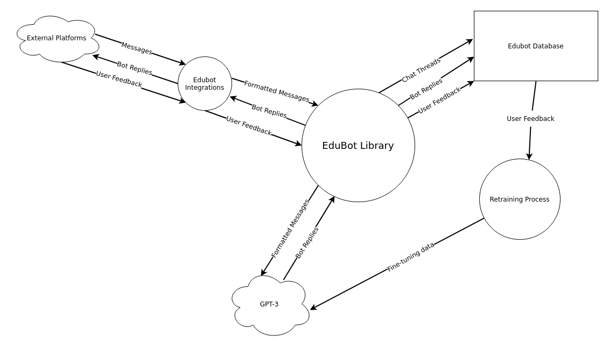

# Edubot

A self-improving AI-based chatbot library that is completely platform-agnostic.

Edubot intuitively jumps into conversations to give advice, make jokes, and add to the discussion. It's personality can be completely customised to suit the tone of different rooms.

By simply reacting to messages with a thumbs up/down, users help Edubot collate feedback. This feedback is used to fine-tune the bot and improve it's responses in the future.

Edubot is still under active development and is the first project from [Open EdTech](https://openedtech.global).

## Architecture
1. Edubot integrations convert messages from external platforms into a standardised format.
1. The library uses these messages to generate a response from GPT-3.
1. Users send feedback to the bot's responses.
1. Using the feedback, the library fine-tunes GPT-3's responses to better suit each thread it partakes in.

## Dev environment quickstart
1. Install [Poetry](https://python-poetry.org/docs/)
1. Install dependencies: `poetry install`
1. Activate the env: `poetry shell`
1. Install pre-commit hooks: `pre-commit install`
1. Copy SAMPLE_CONFIG.ini and put your information in
1. Set the `EDUBOT_CONFIG` env variable to wherever you put your config

For an example of an integration using this library see: [edubot-matrix](https://github.com/openedtech/edubot-matrix)
